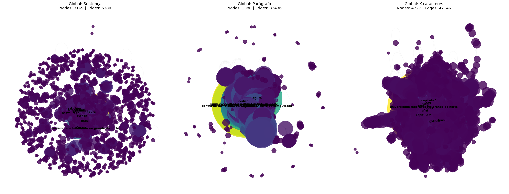

# Análise de Redes de Conhecimento: Mapeando a Engenharia de Computação na UFRN via TCCs


## 📺 Demonstração em Vídeo
Confira a explicação detalhada do projeto e a análise dos resultados no link abaixo:
> **[Link para o Vídeo no Loom]**

---

## 📌 Resumo do Projeto
Este projeto aplica técnicas de **Processamento de Linguagem Natural (PLN)** e **Ciência das Redes** para extrair e visualizar o ecossistema de conhecimento contido nos Trabalhos de Conclusão de Curso (TCCs) de Engenharia de Computação da UFRN. 

O objetivo é identificar as tecnologias predominantes, os autores seminais citados e como diferentes critérios de vizinhança textual (janelamento) influenciam a topologia da rede de conhecimento acadêmico.

---

## 🛠️ Metodologia e Pipeline

O projeto foi dividido em duas fases estratégicas para garantir a robustez da análise:

### Fase 1: Validação e Prova de Conceito
Iniciamos processando um único documento (*Estudo Comparativo de Variantes de Autoencoders*, de Magnus Brígido) para calibrar o motor de **Reconhecimento de Entidades Nomeadas (NER)** do `spaCy` e validar as funções de co-ocorrência. Esta etapa permitiu ajustar os parâmetros de centralidade antes da escala global.

### Fase 2: Análise Global (Big Data Acadêmico)
Expandimos o pipeline para processar simultaneamente **15 TCCs** do curso. Nesta fase, consolidamos milhares de conexões em um único grafo global, revelando as tendências transversais de todo o curso.

### Estratégias de Janelamento
Comparamos três métodos para definir quando dois termos estão "conectados":
1. **Sentença:** Conexão apenas se os termos aparecem na mesma frase (Alta precisão).
2. **Parágrafo:** Conexão se aparecem no mesmo bloco de texto (Contexto temático).
3. **K-caracteres (500):** Janela física deslizante (Exploração de vizinhança).

---

## 📊 Resultados e Análise de Desempenho

### Tabela Comparativa Global (15 Trabalhos)
Os dados abaixo refletem a estrutura consolidada da rede de conhecimento:

| Método | Nós (Vértices) | Arestas (Conexões) | Densidade | Cluster. Médio |
| :--- | :--- | :--- | :--- | :--- |
| **Global: Sentença** | 3.169 | 6.380 | 0.0013 | 0.5540 |
| **Global: Parágrafo** | 1.380 | 32.436 | 0.0341 | 0.9046 |
| **Global: K-caracteres** | 4.727 | 47.146 | 0.0042 | 0.7250 |

**Análise Crítica:** O método de **Parágrafo** apresentou o maior Coeficiente de Agrupamento (0.90), confirmando que a escrita acadêmica em Engenharia de Computação é organizada em "silos temáticos" onde as tecnologias de uma área estão fortemente densas entre si.

### Visualização da Rede

*Legenda: À esquerda, a precisão da Sentença; ao centro, a densidade temática do Parágrafo; à direita, a abrangência ruidosa de K-caracteres.*

---

## 🏆 Top 10 Hubs de Conhecimento (Ranking de Centralidade)

Utilizando a **Centralidade de Grau**, identificamos os termos mais influentes que atuam como pontes entre diferentes trabalhos:

1. **Figura** (Ruído de extração/Legendas)
2. **UFRN** (Institucional/Conector Global)
3. **Python** (Principal Hub Tecnológico)
4. **Brasil** (Localização)
5. **RAG** (Tendência: Retrieval-Augmented Generation)
6. **LLMs** (Tendência: Large Language Models)
7. **Streamlit** (Deploy de aplicações de dados)
8. **Universidade Federal do Rio Grande do Norte**
9. **LangChain** (Orquestração de modelos de IA)
10. **Docker** (Infraestrutura/Containerização)

**Insight de Engenharia:** Os resultados revelam uma guinada clara do curso para a área de **IA Generativa**, com tecnologias como *RAG*, *LLMs* e *LangChain* figurando no topo, superando bibliotecas clássicas.

---

## ⚠️ Limitações e Trabalhos Futuros
A análise identificou que o termo "figura" possui a maior centralidade devido às legendas dos PDFs. Para versões futuras, recomenda-se:
- Implementação de uma lista de *stopwords* customizada para o domínio acadêmico.
- Filtragem de metadados de cabeçalho e rodapé para reduzir ruídos institucionais.

---

## 🔧 Como Executar
1. Clone este repositório.
2. Instale as dependências:
   ```bash
   pip install spacy networkx pandas matplotlib
   python -m spacy download pt_core_news_lg
